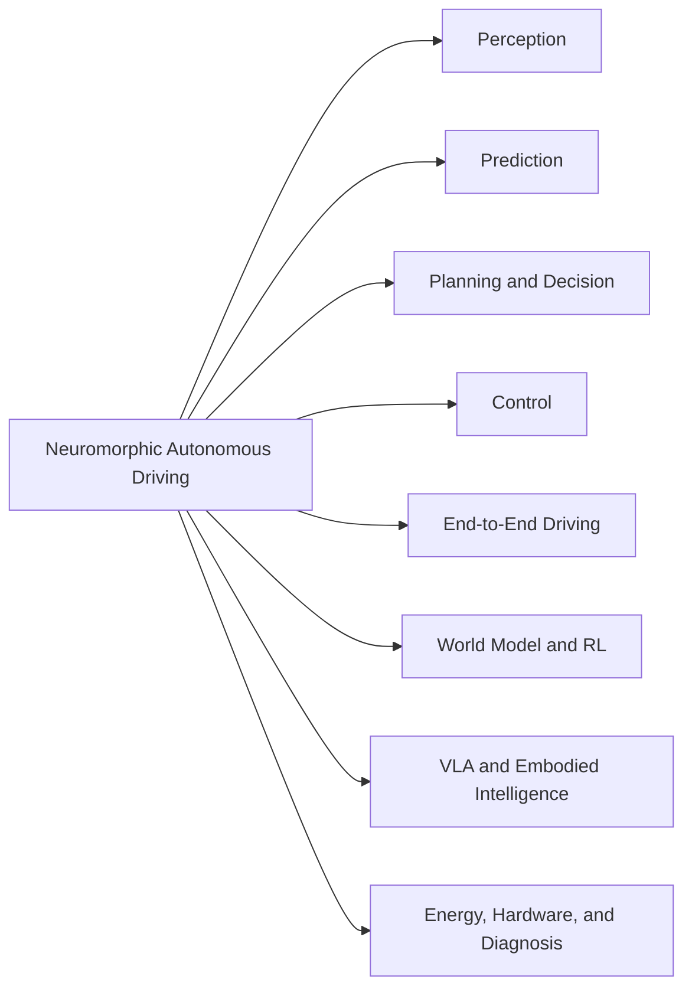

# Awesome Neuromorphic Autonomous Driving 🚗🧠⚡


This repository records and tracks papers on neuromorphic computing, spiking neural networks (SNNs), event-based sensing, and brain-inspired methods for autonomous driving and related embodied navigation tasks.

Papers are grouped by task, and each item includes a reference link whenever a reliable DOI, arXiv, publisher, conference, project, or code page is available.

Contributions are welcome. If a paper is missing, please open an issue or pull request with the title, venue, year, and paper/project/code links.

## 🧰 Maintenance

This repository includes lightweight maintenance scripts in [`scripts/`](scripts/):

```bash
python3 scripts/readme_to_csv.py --force
python3 scripts/fetch_metadata.py
python3 scripts/update_badge_count.py
python3 scripts/check_links.py README.md data/papers.csv
```

`data/papers.csv` stores the structured paper table. `assets/` is reserved for README visuals, and `docs/` stores curation notes.

## 🧭 Taxonomy



## 📚 Papers

### 📌 Survey and Position Papers

* Spiking neural networks for autonomous driving: A review. `EAAI 24` [[Paper](https://doi.org/10.1016/j.engappai.2024.109415)]
* Event-Based Neuromorphic Vision for Autonomous Driving: A Paradigm Shift for Bio-Inspired Visual Sensing and Perception. `IEEE SPM 20` [[Paper](https://doi.org/10.1109/msp.2020.2985815)] [[PDF](https://mediatum.ub.tum.de/1550369)]
* Deep Event-Based Object Detection in Autonomous Driving: A Survey. `BigDIA 24` [[Paper](https://doi.org/10.1109/bigdia63733.2024.10808654)]
* Exploring Deep Spiking Neural Networks for Automated Driving Applications. `VISIGRAPP 19` [[Paper](https://arxiv.org/abs/1903.02080)]
* Neuromorphic Computing for Embodied Intelligence in Autonomous Systems: Current Trends, Challenges, and Future Directions. `IOLTS 25` [[Paper](https://doi.org/10.1109/iolts65288.2025.11116950)]
* Advancing Neuromorphic Computing With Loihi: A Survey of Results and Outlook. `Proceedings of the IEEE 21` [[Paper](https://doi.org/10.1109/jproc.2021.3067593)] [[PDF](https://ieeexplore.ieee.org/ielx7/5/9420072/09395703.pdf)]
* Embodied neuromorphic intelligence. `Nature Communications 22` [[Paper](https://doi.org/10.1038/s41467-022-28487-2)] [[PDF](https://www.nature.com/articles/s41467-022-28487-2.pdf)]
* Neuromorphic Computing for Interactive Robotics: A Systematic Review. `IEEE Access 22` [[Paper](https://doi.org/10.1109/access.2022.3219440)] [[PDF](https://ieeexplore.ieee.org/ielx7/6287639/6514899/09938437.pdf)]
* Neuromorphic Perception and Navigation for Mobile Robots: A Review. `ACM CSUR 24` [[Paper](https://doi.org/10.1145/3656469)] [[PDF](https://dl.acm.org/doi/pdf/10.1145/3656469)]
* Editorial: Brain-inspired autonomous driving. `Frontiers in Neurorobotics 25` [[Paper](https://doi.org/10.3389/fnbot.2025.1543115)] [[PDF](https://www.frontiersin.org/journals/neurorobotics/articles/10.3389/fnbot.2025.1543115/pdf)]
* Networks of spiking neurons: The third generation of neural network models. `Neural Networks 97` [[Paper](https://doi.org/10.1016/S0893-6080(97)00011-7)]
* Towards spike-based machine intelligence with neuromorphic computing. `Nature 19` [[Paper](https://doi.org/10.1038/s41586-019-1677-2)]
* Surrogate gradient learning in spiking neural networks. `IEEE SPM 19` [[Paper](https://doi.org/10.1109/MSP.2019.2931595)]
* Event-based vision: A survey. `TPAMI 22` [[Paper](https://doi.org/10.1109/TPAMI.2020.3008413)]
* Loihi: A neuromorphic manycore processor with on-chip learning. `IEEE Micro 18` [[Paper](https://doi.org/10.1109/MM.2018.112130359)]
* Low-latency automotive vision with event cameras. `Nature 24` [[Paper](https://doi.org/10.1038/s41586-024-07409-w)]
* Efficient and real-time perception: A survey on end-to-end event-based object detection in autonomous driving. `Frontiers in Robotics and AI 25` [[Paper](https://doi.org/10.3389/frobt.2025.1674421)]
* A survey of decision-making and planning methods for self-driving vehicles. `Frontiers in Neurorobotics 25` [[Paper](https://doi.org/10.3389/fnbot.2025.1451923)]
* Fusion techniques of frame and event cameras in autonomous driving: A review. `Information Fusion 25` [[Paper](https://doi.org/10.1016/j.inffus.2024.102909)]

### 👁️ Perception

* LaneSNNs: Spiking Neural Networks for Lane Detection on the Loihi Neuromorphic Processor. `IROS 22` [[Paper](https://doi.org/10.1109/iros47612.2022.9981034)]
* SpikingRTNH: Spiking Neural Network for 4D Radar Object Detection. `IV 25` [[Paper](https://doi.org/10.1109/iv64158.2025.11097403)]
* Temporal Pulses Driven Spiking Neural Network for Time and Power Efficient Object Recognition in Autonomous Driving. `ICPR 20` [[Paper](https://doi.org/10.1109/icpr48806.2021.9412302)]
* Autonomous Driving using Spiking Neural Networks on Dynamic Vision Sensor Data: A Case Study of Traffic Light Change Detection. `arXiv 23` [[Paper](http://arxiv.org/abs/2311.09225)] [[PDF](https://arxiv.org/pdf/2311.09225)]
* Toward Neuromorphic Perception: Spike-driven Lane Segmentation for Autonomous Driving using LiDAR Sensor. `ITSC 23` [[Paper](https://doi.org/10.1109/itsc57777.2023.10422133)] [[PDF](https://mediatum.ub.tum.de/1716249)]
* Deep SCNN-Based Real-Time Object Detection for Self-Driving Vehicles Using LiDAR Temporal Data. `IEEE Access 20` [[Paper](https://doi.org/10.1109/access.2020.2990416)] [[PDF](https://ieeexplore.ieee.org/ielx7/6287639/8948470/09078792.pdf)]
* CarSNN: An Efficient Spiking Neural Network for Event-Based Autonomous Cars on the Loihi Neuromorphic Research Processor. `IJCNN 21` [[Paper](https://doi.org/10.1109/ijcnn52387.2021.9533738)] [[PDF](https://arxiv.org/pdf/2107.00401)]
* SpikiLi: A Spiking Simulation of LiDAR based Real-time Object Detection for Autonomous Driving. `EBCCSP 22` [[Paper](https://doi.org/10.1109/ebccsp56922.2022.9845647)]
* Research on target detection for autonomous driving based on ECS-spiking neural networks. `Scientific Reports 25` [[Paper](https://doi.org/10.1038/s41598-025-97913-4)] [[PDF](https://www.nature.com/articles/s41598-025-97913-4.pdf)]
* Event-Based Vision Enhanced: A Joint Detection Framework in Autonomous Driving. `ICME 19` [[Paper](https://doi.org/10.1109/icme.2019.00242)]
* Object Detection based on LIDAR Temporal Pulses using Spiking Neural Networks. `arXiv 18` [[Paper](http://arxiv.org/abs/1810.12436)] [[PDF](https://arxiv.org/pdf/1810.12436)]
* DRiVE: Dynamic Recognition in VEhicles using snnTorch. `arXiv 25` [[Paper](http://arxiv.org/abs/2502.10421)] [[PDF](https://arxiv.org/pdf/2502.10421)]
* Enhancing Autonomous Driving Perception: A Practical Approach to Event-Based Object Detection in CARLA and ROS. `Vehicles 25` [[Paper](https://doi.org/10.3390/vehicles7020053)] [[PDF](https://www.mdpi.com/2624-8921/7/2/53/pdf?version=1748600396)]
* EV-SegNet: Semantic segmentation for event-based cameras. `CVPRW 19` [[Paper](https://doi.org/10.1109/CVPRW.2019.00210)]
* ESS: Learning event-based semantic segmentation from still images. `ECCV 22` [[Paper](https://doi.org/10.1007/978-3-031-19821-2_20)]
* DSEC: A stereo event camera dataset for driving scenarios. `RA-L 21` [[Paper](https://doi.org/10.1109/LRA.2021.3073670)]
* Driving in spikes: An entropy-guided object detector for spike cameras. `arXiv 25` [[Paper](https://arxiv.org/abs/2511.15459)]
* DDD17: End-to-end DAVIS driving dataset. `arXiv 17` [[Paper](https://arxiv.org/abs/1711.01458)]
* A large scale event-based detection dataset for automotive. `arXiv 20` [[Paper](https://arxiv.org/abs/2001.08499)]
* K-Radar: 4D Radar object detection for autonomous driving in various weather conditions. `arXiv 22` [[Paper](https://arxiv.org/abs/2206.08171)]

### 🔮 Prediction

* Deployment-Friendly Lane-Changing Intention Prediction Powered by Brain-Inspired Spiking Neural Networks. `IV 25` [[Paper](https://doi.org/10.1109/iv64158.2025.11097793)]
* Less is More: Efficient Brain-Inspired Learning for Autonomous Driving Trajectory Prediction. `ECAI 24` [[Paper](https://doi.org/10.3233/faia241013)] [[PDF](https://ebooks.iospress.nl/pdf/doi/10.3233/FAIA241013)]
* Event-Based Vision Meets Deep Learning on Steering Prediction for Self-Driving Cars. `Zurich Open Repository 18` [[Paper](https://doi.org/10.5167/uzh-175994)]

### 🚘 End-to-End Driving

* Autonomous Driving with Spiking Neural Networks. `arXiv 24` [[Paper](http://arxiv.org/abs/2405.19687)] [[PDF](https://arxiv.org/pdf/2405.19687)]
* A Brain-Inspired Perception-Decision Driving Model Based on Neural Pathway Anatomical Alignment. `arXiv 25` [[Paper](http://arxiv.org/abs/2502.16027)] [[PDF](https://arxiv.org/pdf/2502.16027)]
* Brain-Inspired Deep Imitation Learning for Autonomous Driving Systems. `arXiv 21` [[Paper](http://arxiv.org/abs/2107.14654)] [[PDF](https://arxiv.org/pdf/2107.14654)]

### 🧩 Decision and Planning

* New Spiking Architecture for Multi-Modal Decision-Making in Autonomous Vehicles. `AAMAS 26 withdrawn` [[Paper](https://doi.org/10.65109/cnhg1330)]
* Decision SpikeFormer: Spike-Driven Transformer for Decision Making. `CVPR 25` [[Paper](https://doi.org/10.1109/cvpr52734.2025.01792)]
* Dynamic path planning with spiking neural networks. `LNCS 97` [[Paper](https://doi.org/10.1007/bfb0032596)]
* A Framework for Active Vision-Based Robot Planning using Spiking Neural Networks. `MED 22` [[Paper](https://doi.org/10.1109/med54222.2022.9837132)]
* A generative spiking neural-network model of goal-directed behaviour and one-step planning. `PLoS Computational Biology 20` [[Paper](https://doi.org/10.1371/journal.pcbi.1007579)] [[PDF](https://journals.plos.org/ploscompbiol/article/file?id=10.1371/journal.pcbi.1007579&type=printable)]
* A Rapid Adapting and Continual Learning Spiking Neural Network Path Planning Algorithm for Mobile Robots. `RA-L 24` [[Paper](https://doi.org/10.1109/lra.2024.3457371)]
* EV-Planner: Energy-Efficient Robot Navigation via Event-Based Physics-Guided Neuromorphic Planner. `RA-L 24` [[Paper](https://doi.org/10.1109/lra.2024.3350982)]
* Energy-Efficient Autonomous Aerial Navigation with Dynamic Vision Sensors: A Physics-Guided Neuromorphic Approach. `IJCNN 25` [[Paper](https://doi.org/10.1109/ijcnn64981.2025.11228909)]
* Fully Autonomous Neuromorphic Navigation and Dynamic Obstacle Avoidance. `NeurIPS 25` [[Paper](https://papers.neurips.cc/paper_files/paper/2025/hash/50ee6db59fca8643dc625829d4a0eab9-Abstract-Conference.html)] [[PDF](https://papers.neurips.cc/paper_files/paper/2025/file/50ee6db59fca8643dc625829d4a0eab9-Paper-Conference.pdf)]
* Brain-like path planning algorithm based on spiking neural network. `ICIBA 25` [[Paper](https://doi.org/10.1145/3746709.3746943)] [[PDF](https://dl.acm.org/doi/pdf/10.1145/3746709.3746943)]
* Neuromorphic Computing for Autonomous Racing. `ICONS 21` [[Paper](https://doi.org/10.1145/3477145.3477170)] [[PDF](https://www.osti.gov/servlets/purl/1827034)]
* Autonomous Driving of a Rover-Like Robot Using Neuromorphic Computing. `LNCS 21` [[Paper](https://doi.org/10.1007/978-3-030-85099-9_5)]

### 🎛️ Control

* Autonomous driving controllers with neuromorphic spiking neural networks. `Frontiers in Neurorobotics 23` [[Paper](https://doi.org/10.3389/fnbot.2023.1234962)] [[PDF](https://www.frontiersin.org/articles/10.3389/fnbot.2023.1234962/pdf)]
* Continuous adaptive nonlinear model predictive control using spiking neural networks and real-time learning. `Neuromorphic Computing and Engineering 24` [[Paper](https://doi.org/10.1088/2634-4386/ad4209)]
* Neuromorphic quadratic programming for efficient and scalable model predictive control. `arXiv 24` [[Paper](https://arxiv.org/abs/2401.14885)]
* An Energy-Efficient Lane-Keeping System Using 3D LiDAR Based on Spiking Neural Network. `IROS 23` [[Paper](http://dx.doi.org/10.1109/iros55552.2023.10342044)] [[PDF](https://mediatum.ub.tum.de/1713686)]
* LiDAR-driven spiking neural network for collision avoidance in autonomous driving. `Bioinspiration & Biomimetics 21` [[Paper](https://doi.org/10.1088/1748-3190/ac290c)]
* Indirect and direct training of spiking neural networks for end-to-end control of a lane-keeping vehicle. `Neural Networks 19` [[Paper](https://doi.org/10.1016/j.neunet.2019.05.019)] [[PDF](https://arxiv.org/pdf/2003.04603)]
* End to End Learning of Spiking Neural Network Based on R-STDP for a Lane Keeping Vehicle. `ICRA 18` [[Paper](https://doi.org/10.1109/icra.2018.8460482)] [[PDF](http://mediatum.ub.tum.de/node?id=1429575)]
* Fully neuromorphic vision and control for autonomous drone flight. `Science Robotics 24` [[Paper](https://doi.org/10.1126/scirobotics.adi0591)]

### 🛠️ Fault Diagnosis

* Bioinspired membrane learnable spiking neural network for autonomous vehicle sensors fault diagnosis under open environments. `Reliability Engineering & System Safety 23` [[Paper](https://doi.org/10.1016/j.ress.2023.109102)]

### 🧠 Vision-Language-Action and Embodied Intelligence

* SVL: Spike-based Vision-language Pretraining for Efficient 3D Open-world Understanding. `arXiv 25` [[Paper](https://arxiv.org/abs/2505.17674)] [[Code](https://github.com/bollossom/SVL)]
* Neural Brain: A Neuroscience-inspired Framework for Embodied Agents. `arXiv 25` [[Paper](http://arxiv.org/abs/2505.07634)] [[PDF](https://arxiv.org/pdf/2505.07634)]
* A Brain-inspired Embodied Intelligence for Fluid and Fast Reflexive Robotics Control. `arXiv 26` [[Paper](https://doi.org/10.48550/arxiv.2601.14628)]
* Building Embodied EvoAgent: A Brain-inspired Paradigm for Bridging Multimodal Large Models and World Models. `ACM MM 25` [[Paper](https://doi.org/10.1145/3746027.3754880)]

### 🌍 World Model and Reinforcement Learning

* Implementing Spiking World Model with Multi-Compartment Neurons for Model-based Reinforcement Learning. `arXiv 25` [[Paper](https://arxiv.org/abs/2503.00713)]
* Spiking world models for autonomous driving. `arXiv 25` [[Paper](https://arxiv.org/abs/2505.18977)]

### 🔋 Energy and Hardware

* Energy-Aware Regression in Spiking Neural Networks for Autonomous Driving: A Comparative Study With Convolutional Networks. `International Journal of Intelligent Systems 25` [[Paper](https://doi.org/10.1155/int/4879993)] [[PDF](https://onlinelibrary.wiley.com/doi/pdfdirect/10.1155/int/4879993)]
